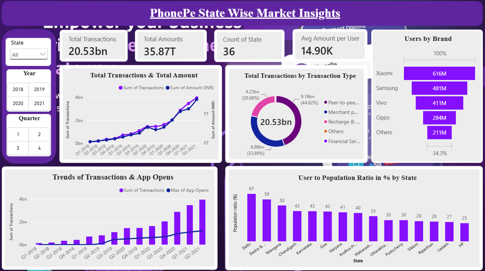

# 📊 PhonePe Pulse: Digital Payments & Market Analytics

An interactive Power BI Business Intelligence project analyzing **20.53B transactions**, **₹36T+ GTV**, and demographic adoption across **731 Indian districts** (2018 – Q2 2021)[cite: 2].

---

## 🎯 Executive Snapshot

| Metric | Value | Business Significance |
| :--- | :--- | :--- |
| **Gross Transaction Value (GTV)** | **₹35.87T – ₹36.30T** | Total circulating transaction capital[cite: 2]. |
| **Total Volume** | **20.53 Billion** | Scale of national digital adoption[cite: 2]. |
| **Registered Base** | **305.26 Million** | Active user profiles mapped across 731 districts[cite: 2]. |
| **Average Spend / User** | **₹14.90K** | Cumulative spend per user profile[cite: 2]. |
| **National Ticket Size (ATV)** | **₹1,502 ➔ ₹1,802** | Sustained platform trust & ticket formalization[cite: 2]. |

---

## 🖥️ Dashboard Previews

| Page 1: State Market Insights | Page 2: District Demographics & ATV |
| :---: | :---: |
|  | 
|  |

> *Check out the 3rd page (`Executive Insights`) in the repository or download the full Power BI (.pbix) file above.*

---

## 💡 Top 4 Business Insights

* **Shift in Payment Behavior:** Peer-to-Peer (**44.6%**) and Merchant QR (**33.9%**) drive over **80%** of transactions, replacing traditional utility recharges[cite: 2].
* **Regional Disparity:** Over **50%** of volume stems from 5 states: *Karnataka, Maharashtra, Telangana, Andhra Pradesh, and Rajasthan*[cite: 2].
* **Highest ATV Outliers:** Metro areas dominate volume, but remote districts (*Shi Yomi, Saiha, Nicobars*) record highest average ticket sizes (**₹3,500 – ₹5,000+**) due to bulky bank remittances[cite: 2].
* **Demographic Upside:** High digital density in Delhi (67%) and Telangana (50%) contrasts with low penetration in densely populated states (*UP, Bihar < 30%*), marking the primary acquisition frontier[cite: 2].

---

## 🛠️ Tech Stack & Modeling

* **BI Platform:** Microsoft Power BI Desktop[cite: 2]
* **Architecture:** Star / Snowflake Schema linking 5 relational tables via `1:*` relationships[cite: 2]
* **Key DAX Formulas:**
  ```dax
  District ATV = DIVIDE(SUM(Amount), SUM(Transactions), 0)
  Penetration Rate = DIVIDE(MAX(Registered Users), SUM(Population), 0)
